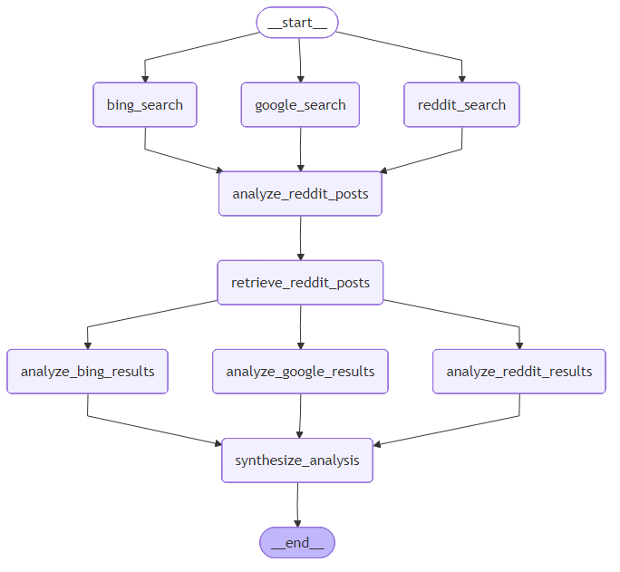

# Advanced Search Engine 🔍

A sophisticated AI-powered research assistant that combines multiple search sources (Google, Bing, Reddit) with LLM analysis to provide comprehensive, multi-perspective answers to user queries.

## Overview

This project leverages the power of LangGraph and LLMs to orchestrate parallel web searches across different platforms, analyze results intelligently, and synthesize findings into cohesive, well-researched answers. It's designed to provide balanced perspectives by incorporating both authoritative sources and community insights.

## Architecture



The system uses a graph-based workflow that:
1. Accepts user queries
2. Performs parallel searches across Google, Bing, and Reddit
3. Analyzes results from each source independently
4. Synthesizes all findings into a comprehensive answer

## Features

- **Multi-Source Search**: Simultaneous queries across Google, Bing, and Reddit
- **Intelligent Analysis**: LLM-powered extraction of key insights from each source
- **Reddit Deep Dive**: Identifies valuable Reddit posts and retrieves detailed discussions
- **Smart Synthesis**: Combines insights from all sources while identifying conflicts and consensus
- **Source Attribution**: Clear citation of where information originates (Google/Bing/Reddit)
- **Community Insights**: Incorporates real user experiences and opinions from Reddit

## Technology Stack

- **LangChain**: LLM orchestration and prompt management
- **LangGraph**: Workflow orchestration and state management
- **Groq**: Fast LLM inference
- **Bright Data API**: Web scraping for search results and Reddit data
- **Python 3.12+**: Core language

## Prerequisites

- Python 3.12 or higher
- Bright Data API account and API key
- Groq API key

## Installation

1. Clone the repository:
```bash
git clone https://github.com/rooneyrulz/agentic-search-engine
cd agentic-search-engine
```

2. Install dependencies using `uv` or `pip`:
```bash
# Using uv (recommended)
uv pip install -e .

# Or using pip
pip install -e .
```

3. Create a `.env` file in the root directory:
```env
BRIGHTDATA_API_KEY=your_brightdata_api_key_here
GROQ_API_KEY=your_groq_api_key_here
```

## Project Structure

```
advanced-search-engine/
├── prompts.py              # LLM prompt templates for different analysis stages
├── web_operations.py       # API interactions for search and data retrieval
├── snapshot_operations.py  # Bright Data snapshot polling and downloading
├── graph.png              # System architecture flowchart
├── pyproject.toml         # Project dependencies and metadata
├── .env                   # Environment variables (create this)
└── README.md             # This file
```

## Core Components

### 1. Prompt Templates (`prompts.py`)

Manages all LLM prompts for different analysis stages:
- **Reddit URL Analysis**: Identifies valuable Reddit posts from search results
- **Google Analysis**: Extracts factual information from Google results
- **Bing Analysis**: Finds complementary insights from Bing
- **Reddit Analysis**: Analyzes community discussions and user experiences
- **Synthesis**: Combines all analyses into a comprehensive answer

### 2. Web Operations (`web_operations.py`)

Handles all external API interactions:
- `serp_search(query, engine)`: Performs Google or Bing searches
- `reddit_search_api(keyword, ...)`: Searches Reddit for relevant posts
- `reddit_post_retrieval(urls, ...)`: Retrieves detailed post and comment data

### 3. Snapshot Operations (`snapshot_operations.py`)

Manages asynchronous data retrieval:
- `poll_snapshot_status(snapshot_id)`: Monitors data collection progress
- `download_snapshot(snapshot_id)`: Downloads completed data snapshots

## Usage Example

```python
from your_main_module import ResearchAssistant

# Initialize the assistant
assistant = ResearchAssistant()

# Ask a question
question = "What are the pros and cons of remote work?"
answer = assistant.research(question)

print(answer)
```

The system will:
1. Search Google, Bing, and Reddit simultaneously
2. Analyze Reddit results to find valuable posts
3. Retrieve detailed discussions from selected posts
4. Analyze findings from each source
5. Synthesize everything into a comprehensive answer with citations

## Configuration

### Reddit Search Parameters

- `date`: Time range for posts ("All time", "Past year", etc.)
- `sort_by`: Sorting method ("Hot", "Top", "New", "Relevance")
- `num_of_posts`: Number of posts to retrieve (default: 75)

### Reddit Post Retrieval Parameters

- `days_back`: How far back to look for comments (default: 10)
- `load_all_replies`: Whether to load all nested replies
- `comment_limit`: Maximum comments to retrieve per post

## API Integration

### Bright Data

This project uses Bright Data's Web Scraping API for:
- SERP (Search Engine Results Page) scraping
- Reddit search and data collection
- Automated snapshot management

Dataset ID: `gd_lvz8ah06191smkebj4`

### Groq

Fast LLM inference for all analysis and synthesis tasks.

## How It Works

### Search Flow

1. **Parallel Search**: Queries are sent to Google, Bing, and Reddit simultaneously
2. **Reddit URL Selection**: LLM analyzes Reddit search results to identify the most valuable posts
3. **Deep Retrieval**: Selected Reddit posts are fetched with their comments
4. **Independent Analysis**: Each source is analyzed separately with specialized prompts
5. **Synthesis**: All analyses are combined into a final, comprehensive answer

### Analysis Strategy

- **Google**: Focus on authoritative sources, facts, and official information
- **Bing**: Capture complementary perspectives and technical details
- **Reddit**: Extract real user experiences, community consensus, and practical advice

## Error Handling

The system includes robust error handling for:
- API request failures
- Timeout scenarios during data collection
- Missing or incomplete data
- Network issues

## Development

### Adding New Search Sources

1. Create new API integration in `web_operations.py`
2. Add analysis prompts in `prompts.py`
3. Update the LangGraph workflow to include the new source
4. Add synthesis logic for the new data

### Customizing Prompts

All prompts are centralized in `prompts.py` using the `PromptTemplates` class. Modify the methods to adjust analysis behavior.

## Limitations

- Requires active Bright Data and Groq API subscriptions
- Rate limited by API quotas
- Reddit data retrieval can be time-consuming for large result sets
- LLM costs scale with query complexity

## Contributing

Contributions are welcome! Please feel free to submit issues or pull requests.

## License

[MIT]

## Acknowledgments

- Built with LangChain and LangGraph
- Powered by Groq for fast LLM inference
- Data sourced via Bright Data APIs

## Support

For issues and questions:
- Open an issue on GitHub
- Check Bright Data documentation: https://docs.brightdata.com
- Review LangGraph docs: https://langchain-ai.github.io/langgraph/

---

**Note**: This is an AI research tool. Always verify critical information from primary sources.